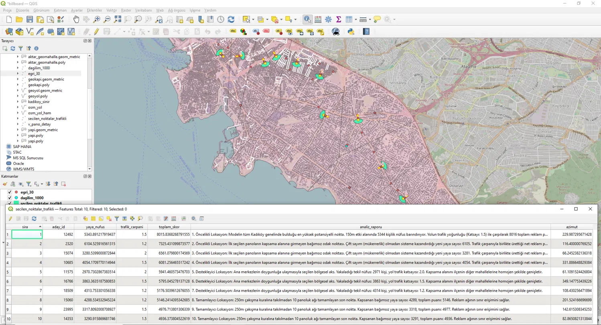

# CBS Tabanlı Billboard Yer Seçimi ve Mekansal Optimizasyon

Kadıköy ilçesinde reklam panosu yer seçimini bir mekansal karar destek
problemi olarak modelleyen, tamamı veri tabanı içinde çözülen analiz.
Netcad Yazılım A.Ş. zorunlu yaz stajı kapsamında geliştirildi (2026).

## 📌 Yaklaşım
- Mahalle nüfusu, adres (kapı) noktaları kullanılarak **dasimetrik** yöntemle adres düzeyine indirgendi.
- Aday konumlar yol ekseni üzerinde `ST_Segmentize` ile 10 m aralıkla üretildi (~25.000 aday); yol hiyerarşisine göre hareketlilik çarpanı atandı.
- Optimum pano seti **açgözlü küme kaplama (greedy set cover)** ile seçildi; aynı kişinin iki kez sayılması ve panoların yan yana dikilmesi engellendi.
- Duyarlılık, marjinal katkı, yön/görünürlük ve Voronoi analizleriyle test edildi.

## 📊 Öne Çıkan Bulgu
Dairesel 150 m görünürlük varsayımıyla 10 pano 40.830 kişiye ulaşıyor görünürken; yön kısıtı ve bina engelleri hesaba katıldığında bu sayı **1.180'e** (kapsama oranı %2.9) düşmektedir.

## 🛠️ Teknolojiler
PostgreSQL 18.6 · PostGIS 3.6.2 · GDAL 3.9.2 · QGIS · EPSG:5254

## 📂 Veri ve Dosya Yapısı
Kurum verisi (adres, bina, mahalle nüfusu) gizlilik nedeniyle repoya dahil
edilmemiştir. Yol ağı: OpenStreetMap / Geofabrik (ODbL).

* `analiz_sorgulari.sql`: Nüfus dağıtımı, aday nokta üretimi, açgözlü küme kaplama algoritması ve yön/görünürlük fonksiyonlarını içeren temel SQL komutları.
* `QGIS.webp`: Analiz sonucunda elde edilen optimum konumların QGIS üzerindeki kartografik sunumu.
